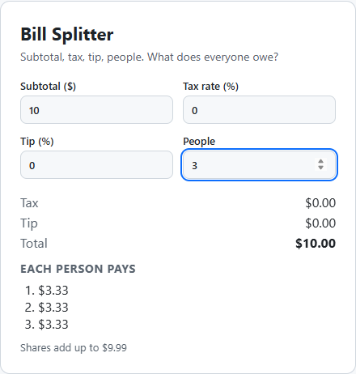
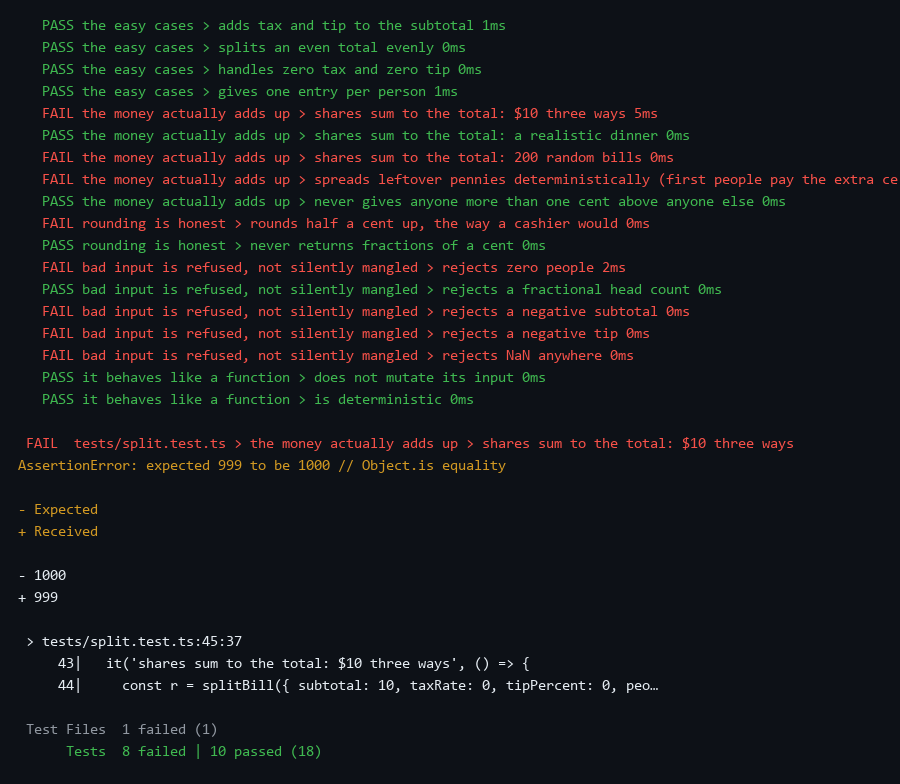
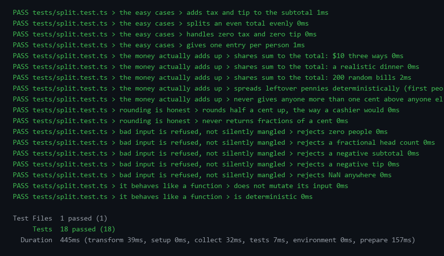

# Tests are your friend

[](LICENSE)
[](https://github.com/NUIAZ/tests-are-your-friend/actions/workflows/test.yml)

A bill splitter small enough to read in one sitting, and the 18 unit tests that
found three bugs in it that clicking around never would have.

This repo is an argument, not a product. The argument is that unit tests are
not a tax you pay after the code works. They are how you find out it doesn't,
and how you earn the right to change it later. The whole thing is about 100
lines of code and 100 lines of tests, and the story is told in four commits you
can check out one at a time.

<p align="center">
  
</p>
<p align="center"><sub>v1. Looks fine. Read the last line.</sub></p>

**Live demo:** <https://nuiaz.github.io/tests-are-your-friend/>

---

## The story, in four commits

| Tag | What happens | Tests |
|---|---|---|
| [`v1-works-on-my-machine`](../../tree/v1-works-on-my-machine) | Bill splitter written, clicked through in the browser, shipped. | none |
| [`v2a-red`](../../tree/v2a-red) | The tests are written as a plain-English spec. Run them against v1. | **8 fail**, 10 pass |
| [`v2b-green`](../../tree/v2b-green) | Fix the three bugs the red tests point at. | 18 pass |
| [`v3-refactor`](../../tree/v3-refactor) | Rewrite the function into named helpers and add a feature. The test file is not touched. | 18 pass |

```bash
git clone https://github.com/NUIAZ/tests-are-your-friend.git
cd tests-are-your-friend && npm install
git checkout v2a-red && npm test     # watch 8 go red
git checkout v2b-green && npm test   # watch them go green
git checkout main
```

### 1. "Works on my machine"

[`src/split.ts` at v1](../../blob/v1-works-on-my-machine/src/split.ts) is 40
lines. Subtotal plus tax plus tip, divided by people, rounded to cents. I typed
a few numbers into the page, the answers looked right, done. Here is the entire
function:

```ts
export function splitBill(input: BillInput): BillResult {
  const tax = input.subtotal * input.taxRate;
  const tip = input.subtotal * (input.tipPercent / 100);
  const total = input.subtotal + tax + tip;
  const each = round2(total / input.people);
  return { tax: round2(tax), tip: round2(tip), total: round2(total),
           perPerson: Array(input.people).fill(each) };
}
```

Nobody writes tests for code like this. It is *obviously* correct.

### 2. The tests that found it

[`tests/split.test.ts`](tests/split.test.ts) is not clever. Every test name is
a sentence a customer would agree with before seeing any code:

- shares sum to the total
- rounds half a cent up, the way a cashier would
- rejects zero people
- does not mutate its input

Run against v1, 8 of 18 fail:

<p align="center"></p>

Three real bugs, and not one of them is visible by using the app:

1. **The shares do not add up.** $10 three ways is 3 × $3.33 = $9.99. The page
   even prints the total as $10.00 right above it. Someone at the table is
   quietly a penny short on every bill that does not divide evenly, and the
   "200 random bills" test shows it is most of them.
2. **$1.005 rounds down to $1.00.** `Math.round(1.005 * 100)` is 100, because
   `1.005 * 100` is `100.49999999999999` in floating point. Cashiers round half
   up. The code did not.
3. **Garbage in, Infinity out.** Zero people, a negative tip, `NaN`: the
   function returned `Infinity` or `NaN` instead of complaining. Whatever called
   it would have carried on with nonsense.

None of these needed a debugger. The failing test names *are* the bug report,
and the assertion diff (`expected 999 to be 1000`) is the reproduction.

### 3. Fix them

[`v2b-green`](../../tree/v2b-green): work in whole cents, hand the leftover
pennies to the first few people so the sum is exact by construction, nudge the
rounding past the floating-point trap, validate input up front. All 18 pass.

<p align="center"></p>

The tests ran in **7 milliseconds**. That number is the other half of the
argument: this is not a slow, ceremonial thing you run before a release. It is
faster than switching to the browser tab.

### 4. Refactor without fear

[`v3-refactor`](../../tree/v3-refactor) rewrites `split.ts` into named helpers
(`validate`, `toCents`, `fromCents`, `distributeCents`), adds a `Cents` type so
units are visible, and adds an optional feature (`pennyOrder`: who eats the
extra pennies). The diff touches almost every line of the source file.

The test file is not in the diff. Not one line changed. All 18 stayed green the
whole way through, and that is what let the refactor happen at all. (A later
"docs" commit adds comments to the test file explaining each case; compare
`v2b-green..v3-refactor` to see the refactor diff on its own.) Without
them, "let me just tidy this up" is a risk you weigh; with them, it is a thing
you do.

---

## What the tests are not

- **Not a mock of the UI.** They test the one function that has logic. The
  page (`src/main.ts`) is thirty lines of wiring and is not tested; it is
  cheaper to look at.
- **Not written after the fact to hit a number.** They are the spec, written as
  sentences, and the code was made to agree with them.
- **Not brittle.** v3 rewrote the implementation and the tests did not notice,
  because they test *behaviour* (shares sum to the total) rather than
  *structure* (calls `round2` three times).

## Run it

```bash
npm install
npm test            # 18 tests, ~10 ms
npm run test:watch  # re-runs on save; leave it open in a corner
npm run dev         # the demo page at http://localhost:5173
```

Note: double-clicking `index.html` will show the form but no result. The page
loads `src/main.ts` as a module and it is Vite that compiles the TypeScript on
the fly, so it needs `npm run dev` (or the hosted demo above), not a `file://`
URL.

## Files

```
src/split.ts          the function (v3), heavily commented with what each version fixed
src/main.ts           form wiring for the demo page
tests/split.test.ts   the 18 tests; read the names as a spec
docs/                 the red and green output as text and PNG, and the demo screenshots
                      (render-terminal.py and screenshot.mjs regenerate them)
```

## License

MIT
